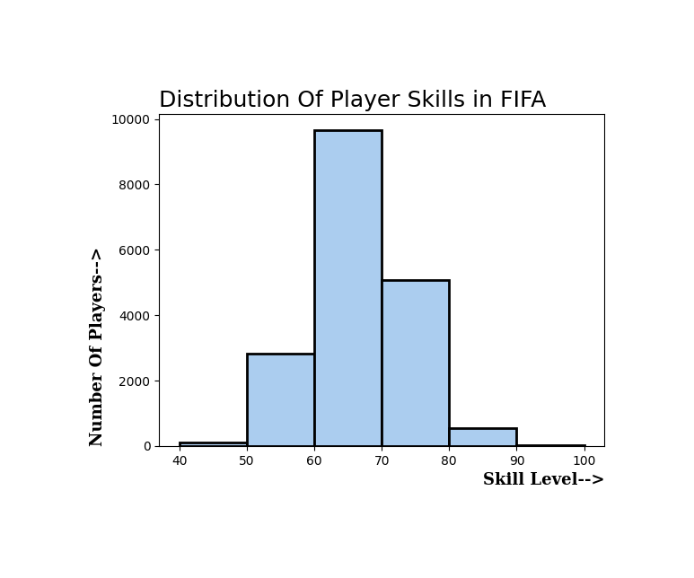

# Visuals_With_PythonLibrary
Here, I have used Gas price and FIFA dataset. Used this dataset to create visualization like line graph, pie chart, histogram, etc.

# Used Libraries
### Pandas
### Matplotlib

# Content
### Line Graph
### Histogram
### Pie Chart
### Box and Whisker Chart

